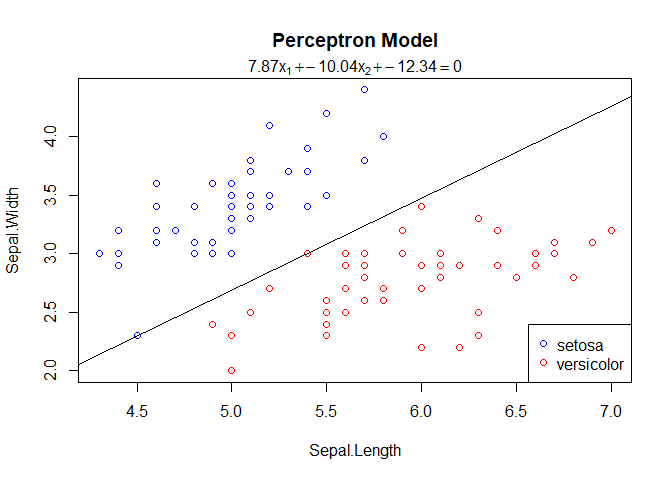
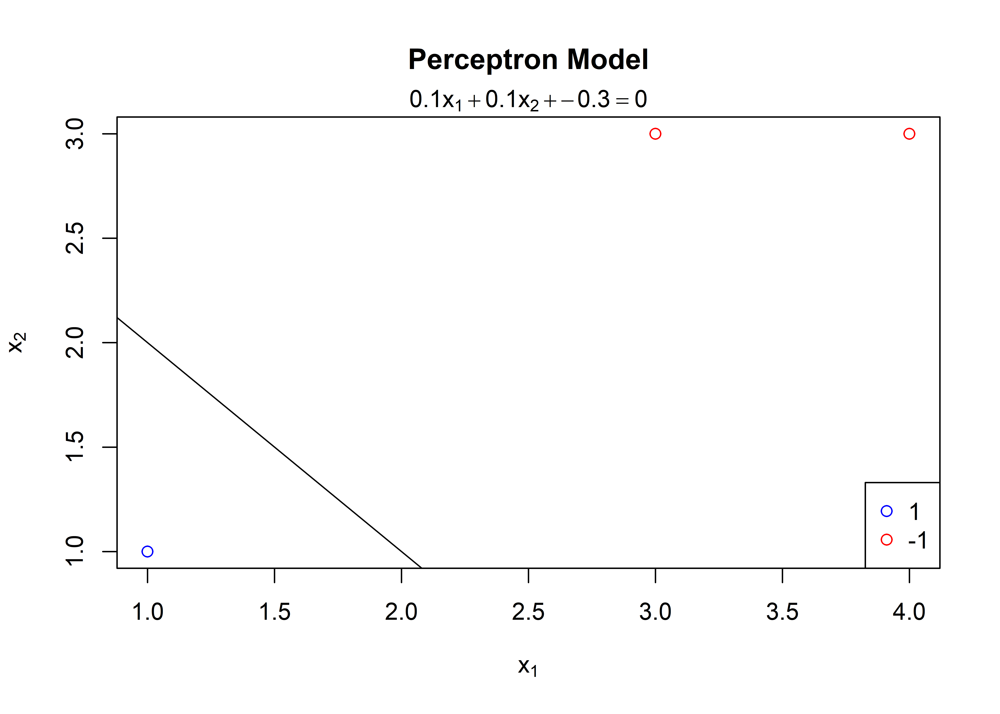
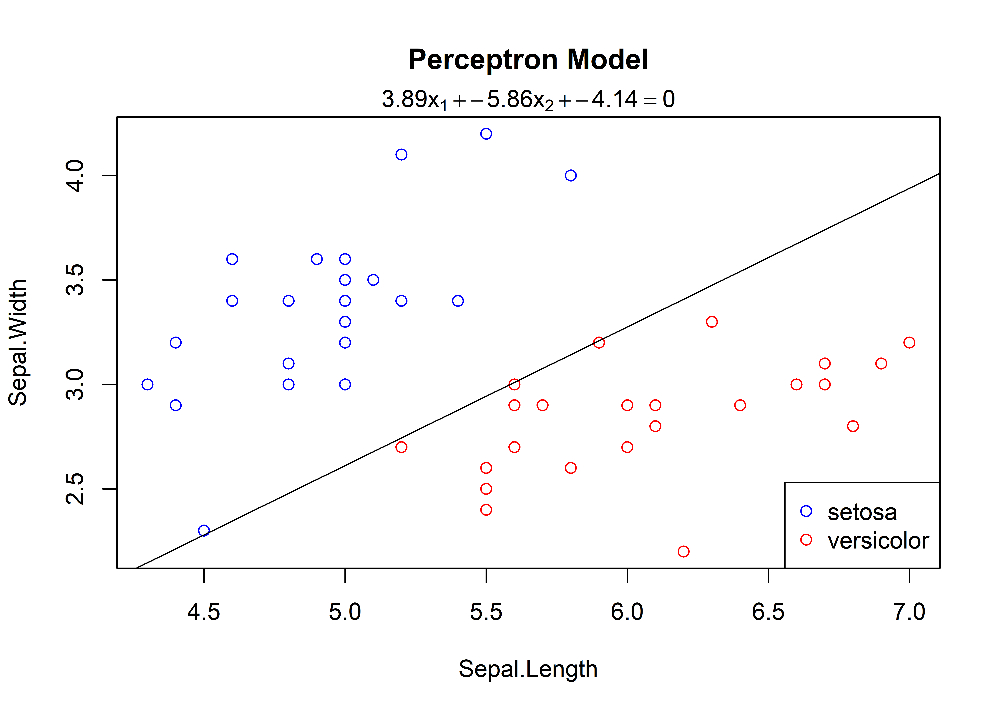
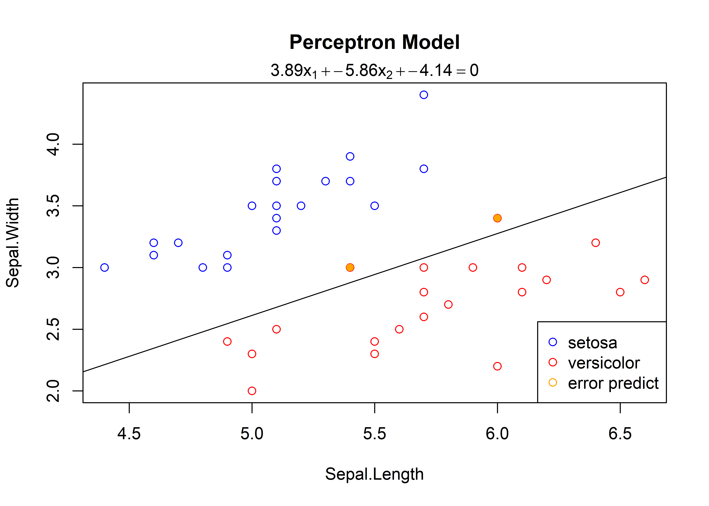

Learn Statistical
================
GongCC
2022-10-14

## Part One: Perceptron

===============Example One===============

``` r
library(learnML)
X <- iris[1:100,1:2]
y <- iris$Species[1:100]
m <- Perceptron$new(max_iteration = 10000)
m$fit(X, y)
```

    ## Initial weights is: -0.560475646552213 , -0.23017748948328 , 
    ## Initial intercept is: 1.55870831414912

    ## epoch:  1541  
    ##  w:  7.869524 -10.04018  b:  -12.34129

``` r
m$plot()
```

<!-- -->

===============Example Two ===============

``` r
library(learnML)
X <- matrix(c(3, 3, 4, 3, 1, 1), ncol = 2, byrow = TRUE)
y <- c(1, 1, -1)
fit <- Perceptron$new()
fit$fit(X, y, w = c(0,0), b = 0)
```

    ## Initial weights is: 0 , 0 , 
    ## Initial intercept is: 0

    ## epoch:  7  
    ##  w:  0.1 0.1     b:  -0.3

``` r
fit$plot()
```

<!-- -->

===============Example Three ===============

``` r
X <- iris[1:100,1:2]
y <- iris$Species[1:100]
set.seed(123)
idx <- sample(100, 50, replace = FALSE)
m <- Perceptron$new()
m$fit(X[idx, ], y[idx])
```

    ## Initial weights is: -0.560475646552213 , -0.23017748948328 , 
    ## Initial intercept is: 1.55870831414912

    ## epoch:  573  
    ##  w:  3.889524 -5.860177  b:  -4.141292

``` r
m$plot()
```

<!-- -->

``` r
pre <- m$predict(X[-idx,], y[-idx])
```

    ##             new_y
    ## pre_y        setosa versicolor virginica
    ##   setosa         25          2         0
    ##   versicolor      0         23         0

``` r
# pre
```

``` r
m$plot(X[-idx, ], y[-idx])
```

<!-- -->

===============Example Four ===============

``` r
X <- iris[1:100,1:4]
y <- iris$Species[1:100]
set.seed(123)
idx <- sample(100, 50, replace = FALSE)
m <- Perceptron$new()
m$fit(X[idx, ], y[idx], seed = 888)
```

    ## Initial weights is: -1.95134334029782 , -1.54436615260889 , 0.729832697018814 , -0.277581798670677 , 
    ## Initial intercept is: -1.65628433919183

    ## epoch:  3  
    ##  w:  -0.1513433 -0.6743662 2.079833 0.1724182    b:  -1.356284

``` r
pre <- m$predict(X[-idx,], y[-idx])
```

    ##             new_y
    ## pre_y        setosa versicolor virginica
    ##   setosa         25          0         0
    ##   versicolor      0         25         0
