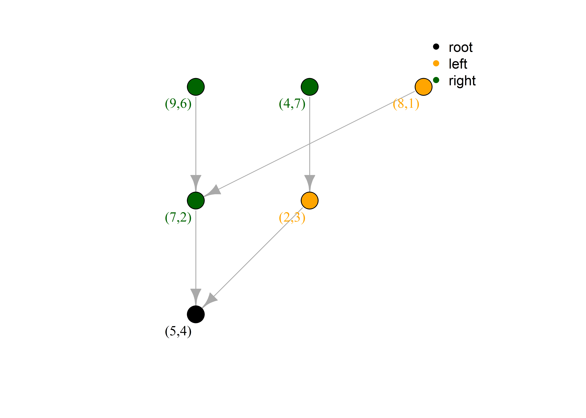
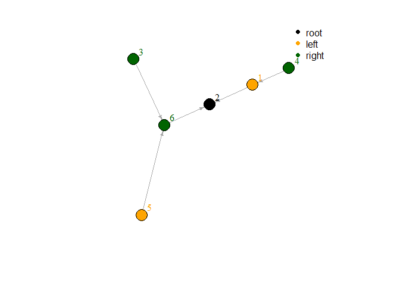

Learn Statistical
================
Gongcc
2022-10-21

## Part One: Perceptron

===============Example One===============

``` r
library(learnML)
X <- iris[1:100,1:2]
y <- iris$Species[1:100]
m <- Perceptron$new(max_iteration = 10000)
m$fit(X, y)
```

    ## Initial weights is: -0.560475646552213 , -0.23017748948328 , 
    ## Initial intercept is: 1.55870831414912

    ## epoch:  1541  
    ##  w:  7.869524 -10.04018  b:  -12.34129

``` r
m$plot()
```

<!-- -->

===============Example Two ===============

``` r
library(learnML)
X <- matrix(c(3, 3, 4, 3, 1, 1), ncol = 2, byrow = TRUE)
y <- c(1, 1, -1)
fit <- Perceptron$new()
fit$fit(X, y, w = c(0,0), b = 0)
```

    ## Initial weights is: 0 , 0 , 
    ## Initial intercept is: 0

    ## epoch:  7  
    ##  w:  0.1 0.1     b:  -0.3

``` r
fit$plot()
```

<!-- -->

===============Example Three ===============

``` r
X <- iris[1:100,1:2]
y <- iris$Species[1:100]
set.seed(123)
idx <- sample(100, 50, replace = FALSE)
m <- Perceptron$new()
m$fit(X[idx, ], y[idx])
```

    ## Initial weights is: -0.560475646552213 , -0.23017748948328 , 
    ## Initial intercept is: 1.55870831414912

    ## epoch:  573  
    ##  w:  3.889524 -5.860177  b:  -4.141292

``` r
m$plot()
```

<!-- -->

``` r
pre <- m$predict(X[-idx,], y[-idx])
```

    ##             new_y
    ## pre_y        setosa versicolor virginica
    ##   setosa         25          2         0
    ##   versicolor      0         23         0

``` r
# pre
```

``` r
m$plot(X[-idx, ], y[-idx])
```

<!-- -->

===============Example Four ===============

``` r
X <- iris[1:100,1:4]
y <- iris$Species[1:100]
set.seed(123)
idx <- sample(100, 50, replace = FALSE)
m <- Perceptron$new()
m$fit(X[idx, ], y[idx], seed = 888)
```

    ## Initial weights is: -1.95134334029782 , -1.54436615260889 , 0.729832697018814 , -0.277581798670677 , 
    ## Initial intercept is: -1.65628433919183

    ## epoch:  3  
    ##  w:  -0.1513433 -0.6743662 2.079833 0.1724182    b:  -1.356284

``` r
pre <- m$predict(X[-idx,], y[-idx])
```

    ##             new_y
    ## pre_y        setosa versicolor virginica
    ##   setosa         25          0         0
    ##   versicolor      0         25         0

``` r
m$model
```

    ## [1] "-0.15 * x[1]+-0.67 * x[2]+2.08 * x[3]+0.17 * x[4]  +  -1.36  == 0"

$- 0.15 x_{1} + - 0.67 x_{2} + 2.08 x_{3} + 0.17 x_{4} + - 1.36 = 0$

## Part Two: KNN

### kd tree

===============Example One ===============

``` r
root <- kd.node$new(item = c(2, 4, 5), axis = 2)
root
```

    ## Item: (2,4,5), Split: 2

``` r
root$node_type()
```

    ## [1] 0

``` r
# 0 represents root node
# 1 represents left node
# 2 represents right node
```

`add_child_auto` function add child node, and it will add new child to
left or right node by the child node item value.

``` r
root$add_child_auto(child = kd.node$new(item = c(1,5,5), 
                                        axis = 3))
root$left
```

    ## NULL

``` r
root$right
```

    ## Item: (1,5,5), Split: 3

``` r
left <- root$add_child(child = kd.node$new(item = c(3, 2, 4),
                                           axis = 4), 
                       type = 'left')
root$left
```

    ## Item: (3,2,4), Split: 4

``` r
left$parent
```

    ## Item: (2,4,5), Split: 2

===============Example Two ===============

``` r
x <- c(2, 5, 9, 4, 8, 7)
y <- c(3, 4, 6, 7, 1, 2)
tree <- kd.tree$new(matrix(c(x, y ), ncol = 2))
tree
```

    ## IGRAPH 9616ac0 DN-- 6 5 -- 
    ## + attr: name (v/c), label (v/c), color (v/n), label.color (v/n)
    ## + edges from 9616ac0 (vertex names):
    ## [1] 1->2 6->2 4->1 5->6 3->6

``` r
tree$plot()
```

<!-- -->

``` r
tree$plot(T)
```

<!-- -->

``` r
tree$df
```

    ##      [,1] [,2]
    ## [1,]    2    3
    ## [2,]    5    4
    ## [3,]    9    6
    ## [4,]    4    7
    ## [5,]    8    1
    ## [6,]    7    2
