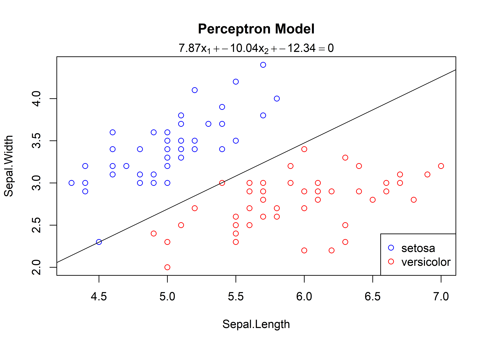

Learn Statistical
================
GongCC
2022-10-14

## Part One: Perceptron

===============Example One===============

``` r
library(learnML)
X <- iris[1:100,1:2]
y <- iris$Species[1:100]
m <- Perceptron$new(max_iteration = 10000)
m$fit(X, y)
```

    ## Initial weights is:  -0.5604756 -0.2301775 
    ##  Initial intercept is:  1.558708 
    ## epoch:  1541  
    ##  w:  7.869524 -10.04018  b:  -12.34129

``` r
m$plot()
```

<!-- -->

===============Example Two ===============

``` r
library(learnML)
X <- matrix(c(3, 3, 4, 3, 1, 1), ncol = 2, byrow = TRUE)
y <- c(1, 1, -1)
fit <- Perceptron$new()
fit$fit(X, y, w = c(0,0), b = 0)
```

    ## Initial weights is:  0 0 
    ##  Initial intercept is:  0 
    ## epoch:  7  
    ##  w:  0.1 0.1     b:  -0.3

``` r
fit$plot()
```

<!-- -->

===============Example Three ===============

``` r
X <- iris[1:100,1:2]
y <- iris$Species[1:100]
set.seed(123)
idx <- sample(100, 50, replace = FALSE)
m <- Perceptron$new()
m$fit(X[idx, ], y[idx])
```

    ## Initial weights is:  -0.5604756 -0.2301775 
    ##  Initial intercept is:  1.558708 
    ## epoch:  573  
    ##  w:  3.889524 -5.860177  b:  -4.141292

``` r
m$plot()
```

<!-- -->

``` r
pre <- m$predict(X[-idx,], y[-idx])
```

    ##             new_y
    ## pre_y        setosa versicolor virginica
    ##   setosa         25          2         0
    ##   versicolor      0         23         0

``` r
pre
```

    ##       y            pred.y      
    ##  [1,] "setosa"     "setosa"    
    ##  [2,] "setosa"     "setosa"    
    ##  [3,] "setosa"     "setosa"    
    ##  [4,] "setosa"     "setosa"    
    ##  [5,] "setosa"     "setosa"    
    ##  [6,] "setosa"     "setosa"    
    ##  [7,] "setosa"     "setosa"    
    ##  [8,] "setosa"     "setosa"    
    ##  [9,] "setosa"     "setosa"    
    ## [10,] "setosa"     "setosa"    
    ## [11,] "setosa"     "setosa"    
    ## [12,] "setosa"     "setosa"    
    ## [13,] "setosa"     "setosa"    
    ## [14,] "setosa"     "setosa"    
    ## [15,] "setosa"     "setosa"    
    ## [16,] "setosa"     "setosa"    
    ## [17,] "setosa"     "setosa"    
    ## [18,] "setosa"     "setosa"    
    ## [19,] "setosa"     "setosa"    
    ## [20,] "setosa"     "setosa"    
    ## [21,] "setosa"     "setosa"    
    ## [22,] "setosa"     "setosa"    
    ## [23,] "setosa"     "setosa"    
    ## [24,] "setosa"     "setosa"    
    ## [25,] "setosa"     "setosa"    
    ## [26,] "versicolor" "versicolor"
    ## [27,] "versicolor" "versicolor"
    ## [28,] "versicolor" "versicolor"
    ## [29,] "versicolor" "versicolor"
    ## [30,] "versicolor" "versicolor"
    ## [31,] "versicolor" "versicolor"
    ## [32,] "versicolor" "versicolor"
    ## [33,] "versicolor" "versicolor"
    ## [34,] "versicolor" "versicolor"
    ## [35,] "versicolor" "versicolor"
    ## [36,] "versicolor" "versicolor"
    ## [37,] "versicolor" "versicolor"
    ## [38,] "versicolor" "versicolor"
    ## [39,] "versicolor" "versicolor"
    ## [40,] "versicolor" "versicolor"
    ## [41,] "versicolor" "versicolor"
    ## [42,] "versicolor" "setosa"    
    ## [43,] "versicolor" "setosa"    
    ## [44,] "versicolor" "versicolor"
    ## [45,] "versicolor" "versicolor"
    ## [46,] "versicolor" "versicolor"
    ## [47,] "versicolor" "versicolor"
    ## [48,] "versicolor" "versicolor"
    ## [49,] "versicolor" "versicolor"
    ## [50,] "versicolor" "versicolor"

``` r
m$plot(X[-idx, ], y[-idx])
```

<!-- -->
